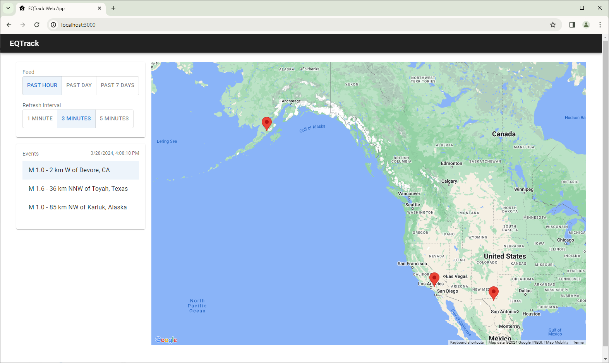

# EQTrack

EQTrack is a web application built with React to view latest earthquake data.

## Getting Started

To get started with EQTrack, follow these steps:

1. Clone the repository to your local machine.
2. Install the necessary dependencies by running `npm install`.
3. Start the development server by running `npm start`.
4. Open [http://localhost:3000](http://localhost:3000) to view the app in your browser.

## Testing

Execute unit tests by running `npm test`.

## Deployment

EQTrack can be deployed using either a build script or Docker. Follow the instructions below:

### Deploy with Build Script

1. Run `npm run build` to build the app for production.
2. Copy the contents of the `build` folder to a remote server directory.

### Deploy with Docker

1. Build the Docker image by running `docker build -t eqtrack --build-arg REACT_APP_GOOGLE_MAP_API_KEY=<YOUR_API_KEY> .`.
2. Verify the image creation by running `docker images | grep eqtrack`.
3. Run the container in detached mode by executing `docker run -p 3000:80 eqtrack`.

## Screenshots

